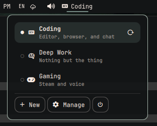
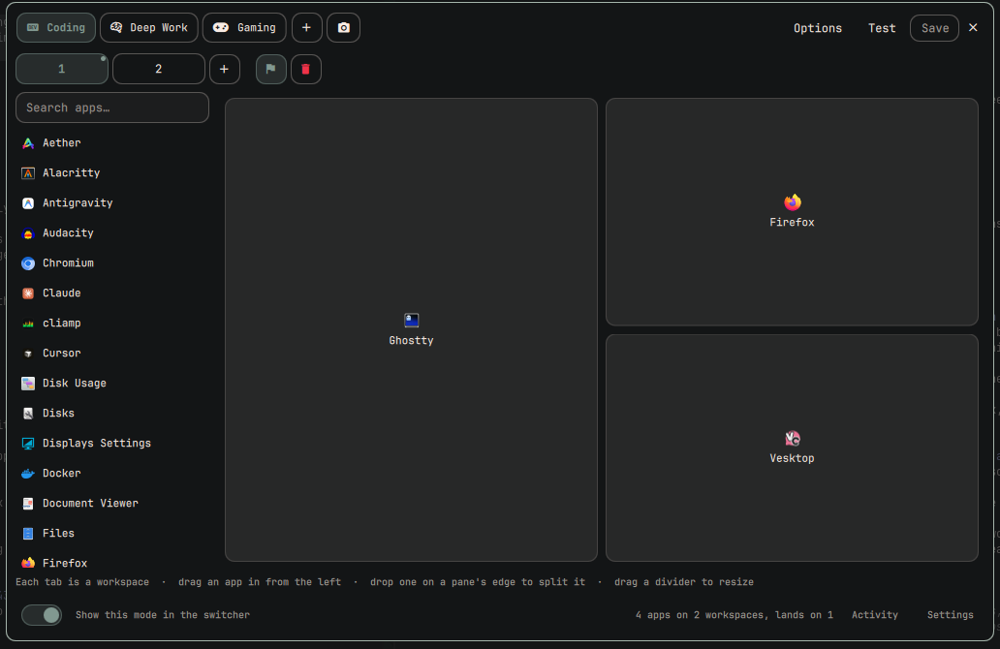
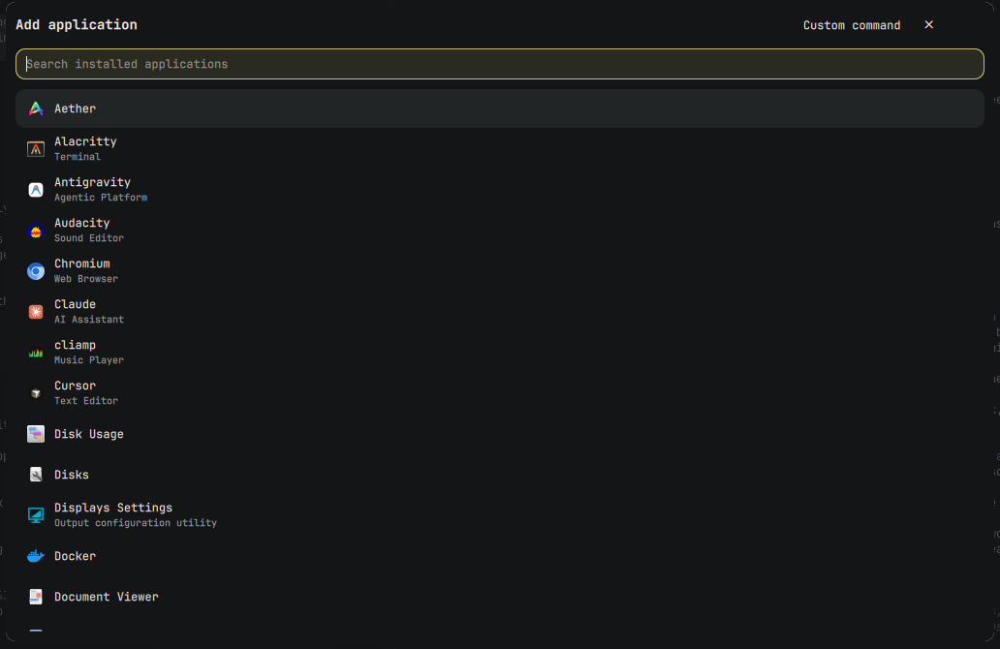
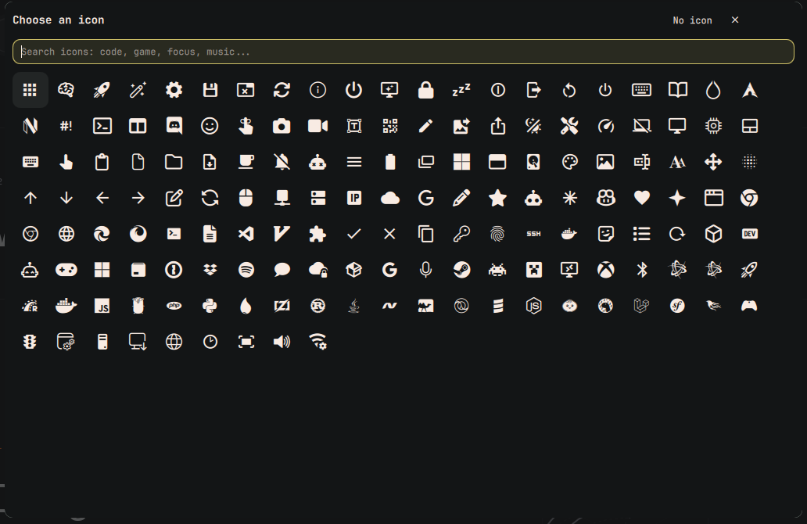
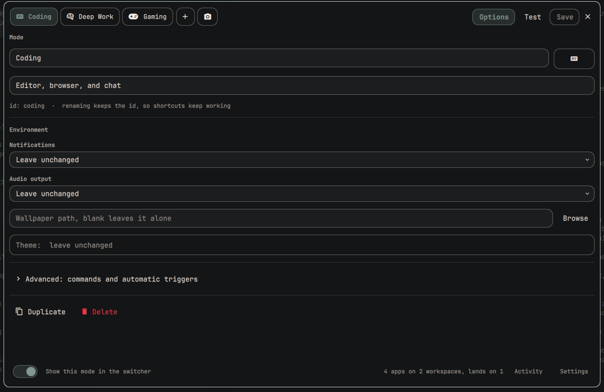

<p align="center">
  
</p>

<h1 align="center">Workspace Modes</h1>

<p align="center"><strong>Switch your entire desktop into the way you work.</strong></p>

A *mode* is a way your desktop is set up. Coding, Gaming, Deep Work, whatever
you actually do. Pick one and Omarchy becomes that: your apps open on the
workspaces you laid them out on, notifications behave, audio goes where it
should, and you land exactly where you meant to start.

```
Coding                              Deep Work
  ws 1  ┌─────────┬─────────┐         Do Not Disturb   on
        │         │ Firefox │         Theme            gruvbox
        │ Ghostty ├─────────┤         Land on          ws 3
        │         │ Slack   │         Everything else  left alone
        └─────────┴─────────┘
  ws 2  Obsidian
  Land on  ws 1
```

You draw that layout; you do not type it. One click, or `omara activate coding`.

Local-first. No account, no cloud, no telemetry, no network access. Workspace
Modes ships **empty**: nothing exists until you make it.

---

## Contents

- [What it does](#what-it-does)
- [What it is not](#what-it-is-not)
- [Install](#install)
  - [Requirements](#requirements)
  - [From git](#from-git)
  - [From a local copy](#from-a-local-copy)
  - [Update](#update) · [Uninstall](#uninstall)
  - [Where things live](#where-things-live)
- [Quick start](#quick-start)
- [Building a mode](#building-a-mode)
  - [Capture the desktop](#capture-the-desktop)
  - [Applications](#applications)
  - [Icons](#icons)
  - [Workspaces](#workspaces)
  - [Environment](#environment)
  - [Commands](#commands)
- [Automatic triggers](#automatic-triggers)
- [Turning a mode off](#turning-a-mode-off)
- [The windows already on screen](#the-windows-already-on-screen)
- [Keybindings](#keybindings)
- [Command line](#command-line)
- [Import and export](#import-and-export)
- [Settings](#settings)
- [Config file](#config-file)
- [Security](#security)
- [Troubleshooting](#troubleshooting)
- [Development](#development)

---

## What it does

Activating a mode can, in this order:

| | |
|---|---|
| **Notifications** | Turn Do Not Disturb on, off, or leave it alone |
| **Audio** | Switch the default output device |
| **Wallpaper** | Set it, via Omarchy's own background command |
| **Theme** | Switch it, via `omarchy theme set` |
| **Windows** | Offer to close what is already open, gracefully, never killed |
| **Applications** | Open them, each on the workspace you chose for it |
| **Commands** | Run your own `onActivate` shell hooks |
| **Workspace** | Land you on the workspace the mode names, once everything is up |

Nothing is mandatory. Every field has a "leave it alone" state and that is the
default, so a mode that only sets a workspace changes only the workspace.

Nothing aborts either: a missing app or an unplugged headset is a warning, the
rest of the mode still applies, and you get one summary notification, never
one per action.

## What it is not

**A session manager.** Workspace Modes does not save or restore window layouts,
and it never will. The workspace canvas is a plan for what a mode *opens* —
which workspace each application lands on and in what order — not a snapshot of
where your windows happen to be sitting, and Workspace Modes never reads
geometry back off the screen. Tools that snapshot your Hyprland windows already
do that job, and Workspace Modes is built to sit alongside one.

| A session manager restores | A mode changes |
|---|---|
| which windows were open | how the desktop behaves |
| where they were placed | what is allowed to interrupt you |
| what they were showing | where sound goes, what starts, where you land |

---

## Install

### Requirements

| | |
|---|---|
| Omarchy | 4.0 (Quattro) or newer |
| Everything else | already on your system: Quickshell, Hyprland, PipeWire, `jq` |

Workspace Modes installs nothing, pulls no dependencies, and makes no network
request after the clone.

Check you are on a new enough Omarchy:

```bash
omarchy plugin list >/dev/null && echo "plugin support: ok"
```

### From git

```bash
omarchy plugin add https://github.com/anishfn/omara.git
omarchy plugin enable io.github.anishfn.omara --section left
```

Plugins land **disabled**, on purpose: a plugin is code that runs inside your
shell, so `add` and `enable` are two steps and the gap between them is for
reading it.

```bash
omarchy plugin add https://github.com/anishfn/omara.git
$EDITOR ~/.config/omarchy/plugins/io.github.anishfn.omara     # read it
omarchy plugin enable io.github.anishfn.omara --section left  # then run it
```

`--section` takes `left`, `center`, or `right`. To put the widget next to
something specific instead:

```bash
omarchy plugin enable io.github.anishfn.omara --section right --before omarchy.clock
```

### From a local copy

No git remote needed. Any folder named after the plugin id under
`~/.config/omarchy/plugins/` is discovered:

```bash
git clone https://github.com/anishfn/omara.git
cp -r omara ~/.config/omarchy/plugins/io.github.anishfn.omara
omarchy plugin enable io.github.anishfn.omara --section left
```

### Check it worked

```bash
omarchy plugin list | grep modes
# io.github.anishfn.omara   enabled   third-party   bar-widget,service   Workspace Modes
```

The widget appears in your bar immediately, reading `○ No mode`. If it does
not, see [Troubleshooting](#troubleshooting).

### Optional: the CLI on your `PATH`

The plugin ships a CLI. Symlink it if you want to drive modes from scripts or
keybindings:

```bash
mkdir -p ~/.local/bin
ln -sf ~/.config/omarchy/plugins/io.github.anishfn.omara/bin/omara \
  ~/.local/bin/omara
omara status
```

Everything it does is also reachable without it, through
`omarchy-shell modes <method>`.

### Update

```bash
omarchy plugin update io.github.anishfn.omara
```

Your modes live outside the plugin folder, so an update never touches them.

### Uninstall

```bash
omarchy plugin remove io.github.anishfn.omara
```

That removes the plugin and its bar placement. Your modes are left behind in
case you come back. To go the rest of the way:

```bash
rm ~/.config/omarchy/omara.json
rm ~/.local/state/omarchy/omara-state.json
rm -f ~/.local/bin/omara
```

Removing the plugin does **not** put back a wallpaper, theme, audio output, or
Do Not Disturb state a mode set. Run *Disable mode* first if you want the
desktop back the way it was.

### Where things live

| Path | What |
|---|---|
| `~/.config/omarchy/plugins/io.github.anishfn.omara/` | the plugin itself |
| `~/.config/omarchy/omara.json` | your modes, safe to version-control |
| `~/.local/state/omarchy/omara-state.json` | what to put back on *Disable mode* |

Those three are the only paths Workspace Modes writes.

---

## Quick start



1. **Click the widget** in your bar. On first run it reads `No mode`.
   There are no modes until you make one.
2. **Create a mode.** Fastest way: set your desktop up the way you like it,
   then press the camera, which captures what is open, where, and how.
   Otherwise press **+** for an empty one. Nothing is preloaded.
3. **Lay out your workspaces.** Under *Workspaces*, drag apps from the list on
   the left onto the canvas on the right. Each tab is a workspace: terminal on
   1, browser on 2, chat on 3. Drop an app on the edge of a pane to split it.
4. **Set where you land.** Press the flag on whichever tab you want the mode
   to leave you on.
5. **Set the mood.** Under **Options**: Do Not Disturb, audio output,
   wallpaper, and theme, each picked from a list rather than typed.
6. **Save**, then click the mode in the bar popup. If windows are already
   open, Workspace Modes asks whether to close them first.

Your apps open across their workspaces without the screen flicking through each
one, and you end up on the workspace you chose.

---

## Building a mode



Right-click the bar widget, or run `omara manage`.

Your modes are the chips along the top; the one you are on is the one below.
The panel is the workspace canvas and almost nothing else, because what a
mode opens is the part you actually edit.

| Up top | |
|---|---|
| **+** | A new, empty mode. No screen in between. |
| **Camera** | A mode made out of the desktop as it is now |
| **Options** | Name, icon, environment, commands, triggers — and Duplicate and Delete |
| **Test** | Save, close, and switch to this mode, so you can see it |
| **Save** | Nothing is written until you press it |

Leaving with unsaved changes asks first, so nothing is lost by accident.
Renaming a mode keeps its `id`, so keybindings and scripts keep working.
**Activity** and **Settings**, bottom right, are the log of what modes have
changed and the behavior switches that apply to all of them.

| Shortcut | |
|---|---|
| `Tab` | Jump into Options, then move field to field |
| `Ctrl+S` | Save |
| `Ctrl+N` | New mode |
| `Ctrl+D` | Duplicate the selected mode |
| `Alt+↑` / `Alt+↓` | Move the selected mode up or down |
| `Esc` | Close, or back out of a picker |

### Capture the desktop

**Capture desktop** turns what you have right now into a mode, with no
typing. It records:

- every open window, matched to its installed application, with the workspace it is on
- the workspace you are looking at, as where the mode leaves you
- the current Do Not Disturb state, audio output, wallpaper, and theme

The editor opens on the result straight away, because a capture is a starting
point rather than a finished mode. Two Firefox windows on two workspaces
capture as two panes, so close the one you did not mean. If the current wallpaper
or Do Not Disturb state is not something you want this mode forcing, set
those fields back to *Leave unchanged*.

From the command line:

```bash
omara capture "Right now"
```

### Applications



Applications live on the **workspace canvas**, described below. The list down
its left side is drawn from the same desktop-entry index the Omarchy launcher
uses, so you get the same names, icons, and sorting. Drag one onto a pane, or
click it to drop it into the pane you have selected. Apps added this way are
stored as a desktop id and launched exactly the way the launcher launches them.

Double-clicking a pane opens the full picker, which also offers **Custom
command** — the escape hatch for what a `.desktop` file cannot say:

```
chromium --new-window https://github.com
ghostty -e btop
omarchy-launch-terminal
```

A custom command is edited in the pane it will run in: pick the pane and the
name becomes the field.

An application can also be switched off without being removed — `"enabled":
false` in the config file. Its pane stays on the canvas, greyed, and the mode
leaves it alone. There is no button for it in the editor; a pane you do not
want is a pane you close.

### Icons



The icon box next to the name, under **Options**, opens a searchable grid.
Search by what you are doing (`code`, `game`, `focus`, `music`, `terminal`) or
browse. **No icon** is always there.

The set is drawn from the glyphs Omarchy's own menu ships, so everything in the
grid is guaranteed to render in your font rather than showing up as an empty
box.

### Workspaces

A mode can lay out as many workspaces as you need, and the canvas is where you
say so.

```
 ┌ 1 ┬ 2 ┬ 3 ┬ + ┐          the workspaces this mode opens
 ├───┴───┴───┴───┴──────────────────────────────────────┐
 │ Search apps…  │  ┌──────────┬──────────┐             │
 │ • Alacritty   │  │          │ Firefox  │             │
 │ • Chromium    │  │  Ghostty ├──────────┤             │
 │ • Firefox     │  │          │  Slack   │             │
 │ • Ghostty     │  └──────────┴──────────┘             │
 └───────────────┴──────────────────────────────────────┘
```

Each tab is one workspace. A pane is one application.

| To | Do |
|---|---|
| Add an application | Drag it in from the left, click an empty pane, or click it in the list to fill the selected pane |
| Split a pane | Drop an application on the pane's edge, or use the split buttons on it |
| Move an application | Drag its pane onto another pane, or onto another workspace's tab |
| Swap two applications | Drag one pane onto the other |
| Resize | Drag the divider between two panes |
| Remove one | The × on the pane |

Click the tab you are already on to rename it. A mode starts with one tab,
workspace `1`; **+** adds the next free number. A tab named nothing at all
reads *Any* and opens its applications wherever you happen to be — useful, but
not where a mode begins, so an empty mode never sits on one.

The flag marks the workspace the mode leaves you on once everything is up; the
tab carries a dot to show which one that is. The bin removes the tab and
everything on it.

What the canvas controls is *which workspace* each application opens on and
*what order* they open in — panes read left to right, top to bottom, and that
is the order things start. The tiling itself is Hyprland's, so the shape you
draw is a plan rather than a guarantee: a two-pane row of Ghostty and Firefox
opens Ghostty first and Firefox second, on that workspace, and your layout
rules do the rest.

Applications are placed using Hyprland's own placement rules, so nothing drags
your focus around while a mode starts up. Named workspaces work as well as
numbers.

A workspace ends up interpolated into a Hyprland dispatch, so the field takes
Hyprland's own grammar and nothing else: an id (`3`), a relative step (`+1`,
`e+1`, `m-1`, `r+1`), a keyword (`previous`, `emptynm`), a name (`project`,
`name:Deep Work`), or a special (`special:magic`). Anything outside that is
refused rather than sent to the compositor.

Some applications, Chromium among them, hand their window to a different process
than the one Hyprland launched, so the placement rule loses track of them.
Workspace Modes watches for the window and moves it to the right workspace
itself when that happens, without following it.

So a Coding mode might be:

| | |
|---|---|
| Workspace `1` | Ghostty |
| Workspace `2` | Firefox │ Slack |
| Lands on | `1` |

Two workspaces populated, and you start on the terminal.

### Environment



Everything that is not the workspace canvas lives behind **Options**: what the
mode is called, its icon, what it does to the environment, and the commands and
triggers under *Advanced*. Duplicate and Delete are at the bottom.

| Field | Options |
|---|---|
| **Notifications** | Leave unchanged, Do Not Disturb on, or Do Not Disturb off |
| **Audio output** | Leave unchanged, or any output PipeWire can see |
| **Wallpaper** | A path, or **Browse** for a file chooser |
| **Theme** | Picked from a list of your installed themes |

An audio device that is not plugged in right now still appears in the list,
marked *(not connected)*, so a mode never quietly forgets which headset it
was pointing at.

The **Theme** button opens a searchable list of every theme on the machine,
both the ones Omarchy ships and the ones you installed into
`~/.config/omarchy/themes/`. A mode stores the same slug Omarchy writes to
`theme.name`, so a captured theme and a picked one are the same value. *Leave
unchanged* is always at the top right.

### Commands

Under **Advanced**. `onActivate` runs when the mode switches on,
`onDeactivate` when it switches off.

These are shell strings, run as `bash -lc '<your string>'` — a login shell, so
your `~/.bash_profile` and `PATH` apply, and pipelines, redirects, `&&` and
substitution all work. That is the reason to write one instead of adding an
application, and it is also the whole of the trust you are extending: the string
is not parsed, escaped, or restricted by Workspace Modes, and a line here can do
anything you can do at a prompt. It is the one field in Workspace Modes that
works this way.

Workspace Modes does not guess at inverses. If a command changes something you
want put back, write the inverse yourself:

```
On activate     omarchy-toggle-idle stay-awake
On deactivate   omarchy-toggle-idle allow-idle
```

---

## Automatic triggers

**Off by default.** Turn them on under *Settings*.

A trigger watches for a window class opening and offers to switch:

```
Switch to Gaming?
steam, click to switch
```

It is a notification with a click action rather than a dialog. A window stealing
your focus is exactly the interruption a mode switch is meant to prevent.
Click to switch, or ignore it.

Per trigger you can pick **Ask**, **Switch** (no prompt), or **Default** (follow
the global *Ask before switching* setting).

Find the class an app actually reports with:

```bash
hyprctl clients -j | jq -r '.[].class'
```

**Loop prevention.** Gaming launches Steam; Steam opening is what the Gaming
trigger watches for. Three rules break that:

1. a trigger for the mode that is already active is ignored
2. any trigger within 8 seconds of an activation is ignored
3. a disabled trigger or mode never fires

**Switch** is a standing permission to run a mode without asking, so it is not
something a file can hand itself: an imported trigger always arrives as **Ask**,
however it was written — including **Default**, which would otherwise follow
your *Ask before switching* setting. Promote it once you have read the mode.

---

## Turning a mode off

*Disable mode* is not *reset to factory defaults*. It puts back the values
**this plugin** changed, to what they were before it changed them, and only
while what is on screen is still what the plugin set. Anything you changed by
hand since is yours and is left alone.

Switching straight from Coding to Gaming does the same thing: Coding's
`onDeactivate` runs, then Gaming applies.

---

## The windows already on screen

A mode opens its own applications, so switching into one on top of a full
desktop leaves you with both. When you click a mode and something is open,
Workspace Modes asks first:

- **Close them** closes every open window, then activates the mode. The
  close is the same request the compositor sends when you hit a window's close
  button, so anything with unsaved work still gets to put up its own prompt.
  Nothing is killed.
- **Keep them** activates the mode on top of what is already there.
- **Cancel** does nothing.

Turn the question off under *Settings → Ask about open windows*, and switching
always keeps what is open.

The question is a click-only thing. Automatic triggers, the shell restart
restore, and the CLI never wait on a dialog: they keep your windows unless you
say otherwise with `omara activate <id> --close`.

---

## Keybindings

Workspace Modes registers no shortcuts. Add what you like to your Hyprland
config:

```
bindd = SUPER, C, Workspace Modes, exec, omara menu
bindd = SUPER SHIFT, C, Coding mode, exec, omara activate coding
bindd = SUPER ALT, C, Manage modes, exec, omara manage
```

Without the CLI on your `PATH`, go through the shell directly:

```
bindd = SUPER, C, Workspace Modes, exec, omarchy-shell shell toggle io.github.anishfn.omara
```

---

## Command line

```
omara list              every mode, as JSON
omara names             ids, one per line
omara current           the active id, empty if none
omara status            one-line summary
omara activate <id> [--close|--keep]
omara deactivate
omara capture [name]    make a mode from the desktop as it is
omara menu              open the bar popup
omara manage            open the manage panel
omara close             close the manage panel
omara edit <id>
omara log               what recent activations did
omara export [id]       export document on stdout
omara reload            re-read the config file
```

`log` is the detail behind the summary notification:

```
$ omara log
      Activating Coding
      Workspace → 1
      Launched Ghostty on workspace 1
      Launched Firefox on workspace 2
WARN  "slack" is not installed; skipped
WARN  Activated Coding with 1 warning(s)
```

---

## Import and export

**Export** writes `omara-export.json` to a folder you pick, or prints one
mode to stdout:

```bash
omara export gaming > gaming.json
```

**Import** previews the file first. The preview lists the *exact lines* each
incoming mode would run — every application and every `onActivate` /
`onDeactivate` string, verbatim — because "this mode runs some commands" is a
count, and a count is not consent. Read them before you press a button; nothing
in the file runs while you are looking at it.

Two things the file does not get to decide for you:

- **automatic triggers** come in as **Ask** — including **Default** — so an
  imported mode can never activate itself
- **nothing runs on import**, only on the activation you choose

If an id already exists you choose **Create copy**, the only option that cannot
lose what you already have, or **Replace existing**.

---

## Settings

Bottom right of the panel, next to **Activity**. Import and export live here
too, since they are about the whole file rather than about one mode.

| Setting | Default | What it does |
|---|---|---|
| Launch applications | on | A mode may start the apps it lists |
| Show a notification | on | One summary per switch |
| Automatic triggers | **off** | Watch for applications at all |
| Ask before switching | on | A trigger asks first unless it says otherwise |
| Ask about open windows | on | Offer to close what is open before switching |
| Restore after shell restart | **off** | Reapply the active mode on startup |

*Restore after shell restart* replays **settings only**: notifications, audio,
wallpaper, theme, and workspace. It never relaunches applications or reruns
commands: Quickshell restarts more often than you would think, and a reload that
reopens six windows is hostile.

---

## Config file

Everything lives in `~/.config/omarchy/omara.json`:

```json
{
  "version": 1,
  "activeMode": "coding",
  "behavior": {
    "confirmAutomaticSwitch": true,
    "confirmWindowsOnSwitch": true,
    "showNotifications": true,
    "launchApps": true,
    "triggersEnabled": false,
    "restoreOnStart": false
  },
  "ui": { "showIcon": true, "showName": true },
  "modes": [
    {
      "id": "coding",
      "name": "Coding",
      "icon": "󰵮",
      "description": "Development environment",
      "enabled": true,
      "appearance": { "wallpaper": null, "theme": null },
      "notifications": { "dnd": false },
      "audio": { "output": null },
      "workspaces": {
        "target": 1,
        "layouts": [
          { "workspace": "1", "tree": { "app": "p1" } },
          {
            "workspace": "2",
            "tree": {
              "split": "row", "ratio": 0.5,
              "children": [{ "app": "p2" }, { "app": "" }]
            }
          }
        ]
      },
      "applications": [
        { "uid": "p1", "desktopId": "com.mitchellh.ghostty", "workspace": 1, "enabled": true },
        { "uid": "p2", "command": "chromium --new-window https://github.com", "workspace": 2, "enabled": true }
      ],
      "commands": { "onActivate": [], "onDeactivate": [] },
      "triggers": [
        { "type": "application", "value": "steam", "enabled": true, "behavior": "ask" }
      ]
    }
  ]
}
```

`null` means *leave it alone* everywhere it appears. `"dnd": false` is a
different instruction from `"dnd": null`. The first turns Do Not Disturb off,
the second does not touch it.

An application has either a `desktopId` or a `command`, never both.

`workspaces.layouts` is the canvas: one entry per workspace tab, each holding a
binary split tree. A node is either a leaf (`{"app": "<uid>"}`, or `""` for an
empty pane) or a split (`row` puts its two children side by side, `column`
stacks them, and `ratio` is the first child's share). `uid` is what ties a pane
to an application across a rename or a reorder.

You do not have to write any of it. `layouts` is optional, and a mode that
leaves it out — a hand-written one, an older config, an import — gets a layout
derived from the `workspace` each of its applications already names. On save,
the two are made to agree: every application sits in exactly one pane, its
`workspace` is the one its pane belongs to, and `applications` comes back in
the order the panes read.

Editing the file by hand works; the plugin watches it and reloads live. Replace
it wholesale (a dotfiles `git checkout`, a restored backup) and the change is
picked up within a minute, or immediately with `omara reload`.

---

## Security

Workspace Modes runs unsandboxed inside `omarchy-shell`, like every Omarchy
plugin. Precisely what that means here:

**It never** makes a network request, downloads or evaluates code from anywhere,
collects telemetry, runs anything on install or import, writes outside
`~/.config/omarchy/omara.json` and
`~/.local/state/omarchy/omara-state.json`, or asks for elevated privileges.

**It does run programs, but only the ones you configured:**

- **Picked applications** are stored as a desktop id and handed to the shell's
  own launcher. Nothing in the mode is interpreted as a command; the
  `.desktop` file already on your system decides what runs.
- **Custom commands** are tokenized like a shell would (quotes honoured) and run
  as an argv vector through `bash -lc 'exec "$@"' bash <argv...>`. The script is
  a constant; your tokens are positional parameters. A filename, URL, or `$(...)`
  inside an argument is literal data and can never become a second command.
- **`onActivate` / `onDeactivate`** *are* shell strings, deliberately, and the
  only ones. They run as `bash -lc '<your string>'` — as you, through your login
  shell, exactly like a line in your own dotfiles. Nothing quotes or restricts
  them, because a hook that cannot use a pipe is not worth having. Treat a mode
  file the way you would treat a `.bashrc` someone sent you.
- **Workspaces** are checked against Hyprland's grammar (`Model.isWorkspaceRef`)
  before they go anywhere near a dispatch, and the Lua dispatch path quotes what
  it sends. A workspace that does not fit the grammar is refused at the edge, at
  save time, so no dispatch string is ever built from an arbitrary value.

**Subprocess boundaries.** The commands that enforce all of this — `timeout`,
`bash`, `stat`, `dd`, `find` and friends — are resolved from `/usr/bin` rather
than through your `PATH`, and the helper scripts pin `PATH` themselves. An entry
earlier in `PATH` would otherwise be able to replace the very checks that make
everything else meaningful. The one deliberate exception is the availability
check for your own configured applications, which has to use your `PATH`,
because that is the thing being tested.

Every process Workspace Modes reads output from runs under
`timeout -k 2` and is capped at the source — bytes, lines and item counts — with
a QML watchdog behind it for a child that is unkillable rather than slow. None
of it can wedge the shell: a FIFO where `theme.name` should be ends the read at
the deadline instead of blocking forever. Output is parsed into closed records
with null-prototype maps, so nothing a subprocess prints can add a key or
inherit one.

**Actions report their real outcome, and land in order.** Setting a theme,
wallpaper, audio output or Do Not Disturb, and launching a desktop entry, all
run supervised: Workspace Modes waits for the exit code and an activation does
not claim success while something it needed has failed or is still trying. They
also run one at a time, in the order they were asked for, because two theme
changes in flight at once can land in either order and leave the desktop showing
something other than the mode that was reported. A verdict from a switch you
have since replaced is logged, but it does not announce itself as the mode you
are in.

Stopping the wait is not the same as stopping the process. An action that
overruns its reporting deadline is left running — killing `omarchy-theme-set`
half way through applying is worse than waiting — and is only torn down on its
real exit, or by a far backstop if it never comes. Three things stay detached, because
they have to outlive the shell — a restart would otherwise kill them:
`onActivate` / `onDeactivate`, raw application commands (where `exec "$@"`
*becomes* the application), and anything Hyprland launches for us. Whether a raw
command can start at all is answered before launch, by the same probe that marks
missing applications.

**Files carry their guarantees in the open itself.** Quickshell's `FileView`
takes a pathname and reads to the end: no `O_NOFOLLOW`, no non-blocking open, no
size ceiling. Checking the name first and then handing the same name over only
narrows that window, so Workspace Modes does not use `FileView` at all. Reads go
through `dd iflag=nofollow,nonblock` with a hard `count`×`bs` ceiling, beneath a
directory verified to be yours and not writable by anyone else — a symlink is
refused by the open, a FIFO returns empty instead of blocking, and an oversized
file is cut off. Writes are the same transaction from the other side: a fresh
`0600` temp file under `umask 077` in that verified directory, renamed over the
target, so a symlink or FIFO at the destination is *replaced* rather than
written through. An incomplete check refuses; a guard you can remove by breaking
it is not a guard.

The same read handles imports, because a path a file chooser produced is still
just a path.

What this does not do is hold one descriptor across an entire read-modify-write.
Each read and each write carries its own guarantees, which is as far as the
available primitives reach.

**Documents have ceilings before they are parsed.** A config or an import is
capped at 4 MiB before `JSON.parse`, then at 200 modes, 100 applications, 50
hooks and 50 triggers per mode, with field limits — all applied before anything
is cloned or drawn, and to the config on disk exactly as to an imported file.
Generous next to any mode file a person would write.

**Saves to one file are serialised.** Two renames racing can land in either
order, which would let an older save overwrite a newer one on disk. Only one
publication per target is ever in flight, and content queued behind it is
coalesced, so what ends up on disk is the newest model rather than whichever
process happened to finish last.

**Importing is the only place untrusted data arrives.** An imported file is
parsed, normalized, and previewed, never applied on sight. The preview shows the
exact command lines each mode would run, not a count of them, and every imported
trigger is pinned to *ask* — *auto* and *default* alike — so an imported mode
cannot activate itself on any machine's settings. Nothing runs until you
activate that mode.

Found a problem? Open an issue describing the class of issue, not a working
exploit.

---

## Troubleshooting

**The widget is not in my bar.** `omarchy plugin list` should show
`io.github.anishfn.omara` enabled. If not:
`omarchy plugin enable io.github.anishfn.omara --section left`.

**The CLI says the plugin is not enabled.** It talks to the running shell. Check
`omarchy-shell shell ping`, then that the plugin is enabled.

**A mode did not do everything.** `omara log`, or the *Activity*
tab in the manage panel. A missing executable, an unplugged device, or an
unreadable wallpaper is a warning; the rest of the mode still applied.

**A captured app is listed twice.** You had two of its windows open, on two
workspaces. Delete the row you do not want.

**A captured window became a raw command instead of an app.** Its window class
did not match any desktop entry. The command is the lowercased class and usually
works; if not, delete it and add the app from the picker.

**An app opened on the wrong workspace.** Its pane is on the *Any* tab, so it
opened wherever you were. Drag the pane onto the tab you meant, or add that
workspace with **+** first.

**An application shows "(not installed)".** The mode names a desktop entry
that is no longer on this machine, usually an imported mode or an app you
removed. The pane is kept so you can see what it pointed at.

**My audio device says "(not connected)".** The device is not present right now.
Plug it in and activate again; the mode is not rewritten.

**The wallpaper chooser seems to do nothing.** The editor unmaps itself while an
external chooser is open. A layer-shell overlay sits above every window, so the
dialog would otherwise open behind it. If the chooser fails to start at all,
`omara log` records the exit code.

**I edited omara.json and nothing happened.** `omara reload`. If
the file could not be parsed, a copy was saved as `omara.json.corrupt` and
the plugin started from defaults rather than overwriting your only copy.

**The theme list is empty.** Workspace Modes reads `$OMARCHY_PATH/themes` and
`~/.config/omarchy/themes`. If `omarchy theme list` prints themes and the picker
does not, `omarchy-restart-shell`.

**I am never asked about my open windows.** Either nothing is open, or
*Settings → Ask about open windows* is off. The question is also skipped on
purpose for triggers, the startup restore, and the CLI.

**Nothing switches when I open Steam.** Triggers are off by default. Turn them
on under *Settings*, and check the class matches what
`hyprctl clients -j | jq -r '.[].class'` reports.

---

## Development

```bash
git clone https://github.com/anishfn/omara.git
cd omara
node --test tests/          # pure-logic unit tests, no desktop needed
omarchy plugin validate .   # the same checks the shell enforces
```

The tests need nothing but `node`. They cover the schema, activation and
restore plans, argv tokenization, import/export, triggers, and capture, and
they also read the QML as text to pin the invariants that are easy to break by
accident: the unsaved-changes guard, the suspend-and-resume contract around
external choosers, the IPC methods the CLI calls, and that every icon comes
from the shared glyph map.

To iterate against a live shell, work in
`~/.config/omarchy/plugins/io.github.anishfn.omara/`, where saving any file reloads the
plugin. QML is cached on disk, so if a stale compile error keeps reappearing
after you fixed it, `omarchy-restart-shell` clears it.

| File | What it is |
|---|---|
| `Model.js` | Schema, activation plans, triggers, import/export, and the bounded parsers for subprocess output. No Qt and no Quickshell, which is why node can test it. |
| `Service.qml` | Config file, runtime snapshot, activation, triggers, the `omara` IPC target, and the editor window. |
| `BarWidget.qml` | Bar button and switcher popup. |
| `ModeRow.qml` | One mode in a list. Reserves the icon slot whether or not the mode filled it, so names line up. |
| `OmaraMark.qml` | The bar mark, drawn as three rectangles on a nine-unit grid so it takes the theme's colour and lands on whole pixels. |
| `EditorWindow.qml` | The manage / edit overlay. |
| `ModeForm.qml` | The edit form for one mode. |
| `WorkspaceCanvas.qml` | The workspace canvas: tabs, the app list, and the drag-and-drop panes. Draws and hit-tests from one `Model.paneRects` call. |
| `AppPicker.qml` | Installed-application picker, backed by the shell's `AppLibrary`. |
| `IconPicker.qml` | Glyph grid for the mode icon, backed by `icons.json`. |
| `ThemePicker.qml` | Installed-theme picker, shipped themes and your own. |
| `PromptDialog.qml` | Modal with more than two answers, which `ConfirmDialog` cannot do. |
| `SwitchDialog.qml` | The close-or-keep question, in its own overlay window. |
| `icons.json` | Curated Nerd Font glyphs with search keywords. |
| `bin/omara` | CLI over the `omara` IPC target. |

The shell instantiates a `service` plugin exactly once per session, which is
what makes "the active mode" one answer rather than one per monitor.

Two rules worth knowing before changing anything:

- **Icons come from `Model.Glyph`, never a literal.** A codepoint can be in a
  font's `cmap` and still paint a filled box, so a new glyph gets checked
  against the font `monospace` actually resolves to before it ships.
- **`activating` must always come back down.** Activation is wrapped in
  `try/finally`; a stuck flag refuses every future switch.

---

## License

MIT. See [LICENSE](LICENSE).
